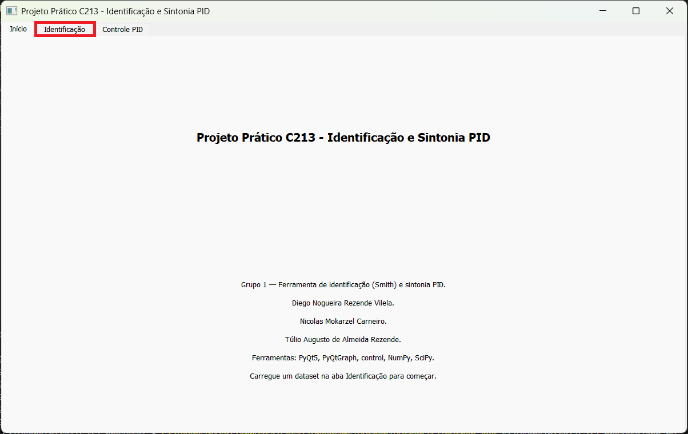
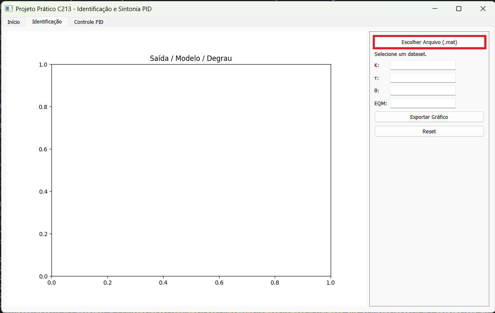
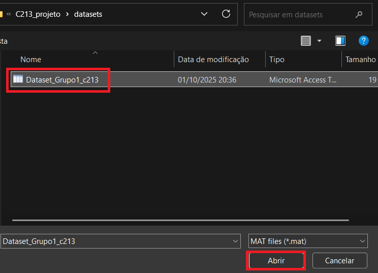
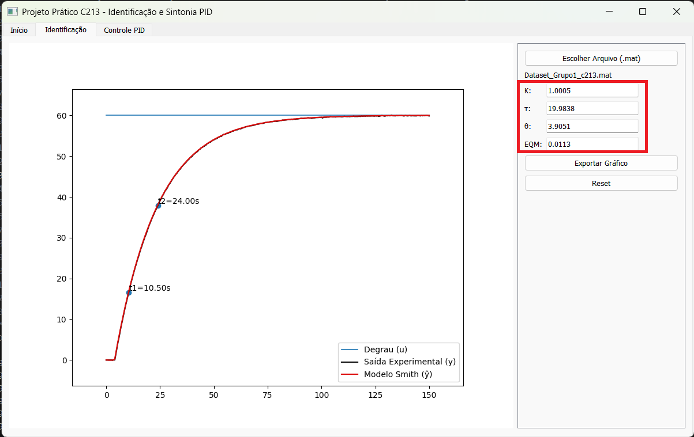
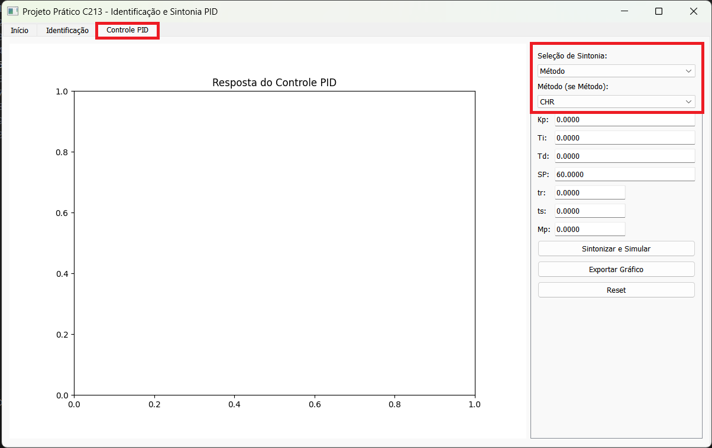
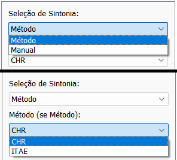
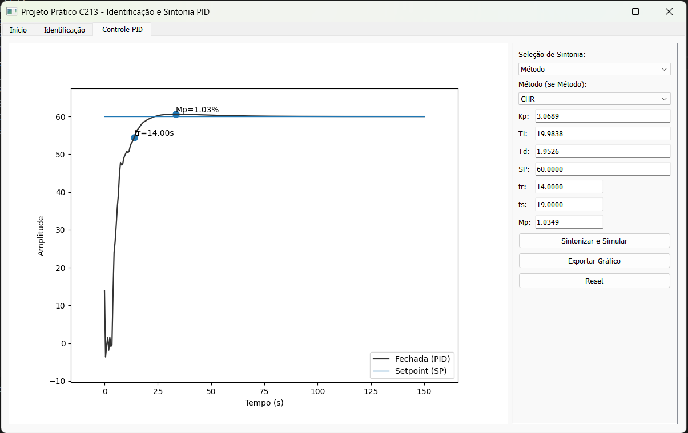
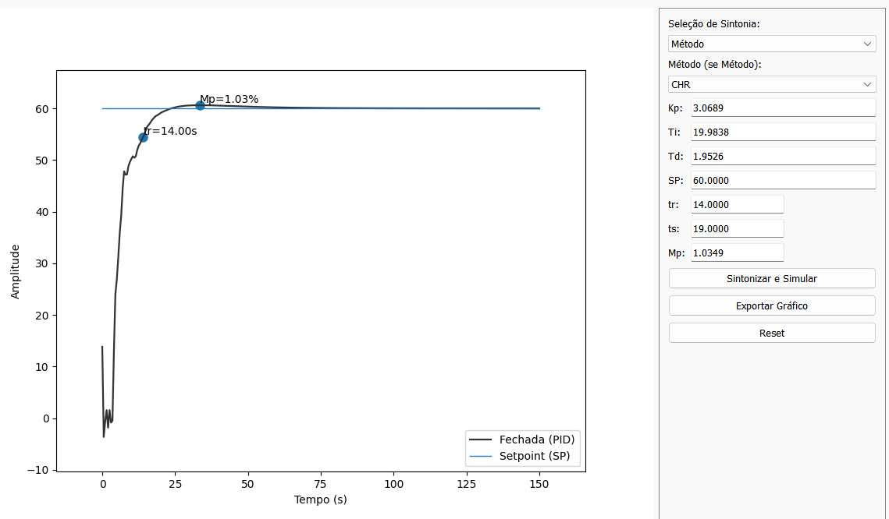
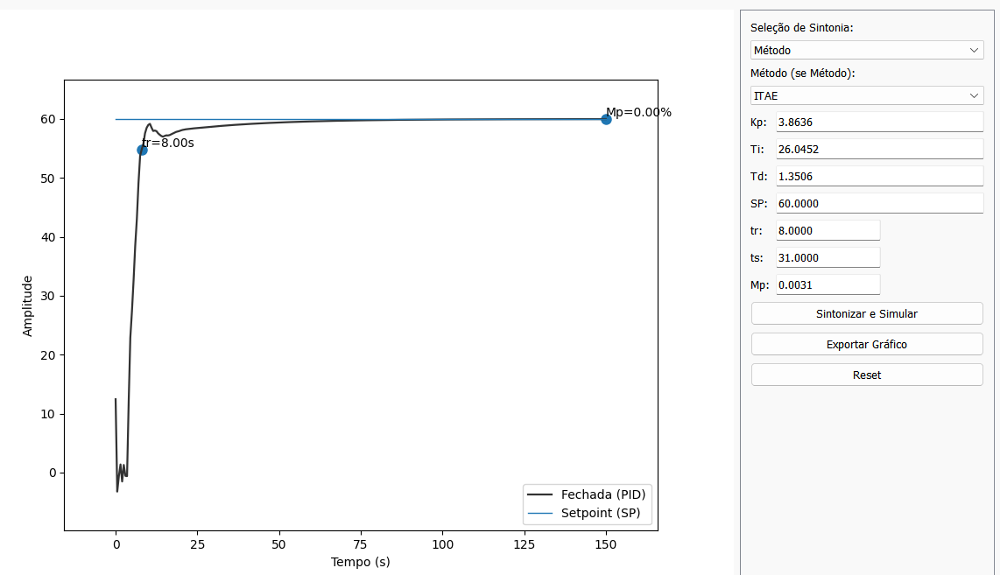

# Projeto de Identificação de Sistemas e Controle PID
###

## Documentação técnica do código

### 1. Introdução

Este projeto tem como objetivo desenvolver uma ferramenta interativa para identificação de sistemas e sintonia de controladores PID, voltada para aplicações didáticas e práticas.

A aplicação permite ao usuário:
- Carregar dados experimentais de sistemas reais ou simulados.
- Identificar os parâmetros de um modelo FOPDT (First Order Plus Dead Time).
- Aplicar métodos clássicos de sintonia PID.
- Visualizar a resposta do sistema e avaliar o desempenho do controlador.

A interface gráfica foi desenvolvida com PyQt5, e o backend utiliza bibliotecas como NumPy, SciPy e Matplotlib para cálculos e visualizações.

### 2. Instalação

Requisitos:

Antes de executar o projeto, certifique-se de ter instalado:

- Python 3.8 ou superior
- pip (gerenciador de pacotes)

Dependências:

```bash
python -m venv .venv
.venv\Scripts\activate
pip install -r requirements.txt
```

### 3. Arquitetura do Projeto

Este projeto é organizado em módulos funcionais, com separação clara entre interface gráfica, lógica de controle e utilitários:

Estrutura de Diretórios

Pasta | Descrição

**models:** Contém o modelo matemático FOPDT e simulações da resposta do sistema.

**tuning:** Implementa os métodos de sintonia PID (CHR e ITAE). 
ui: Interface gráfica com PyQt5, incluindo visualização de gráficos e interação com o usuário.

**metrics:** Cálculo de métricas como EQM, tempo de subida e overshoot.

**datasets:** Armazena os dados experimentais utilizados na identificação.

**Filtragem_dados:** Realiza pré-processamento e suavização dos dados.

**main:** Inicializa a interface gráfica e conecta os módulos.

**README:** Documentação principal do projeto.

**requirements:** Lista de dependências para instalação do ambiente.

Fluxo de Execução

    1. O usuário carrega um dataset experimental via interface.
    2. O sistema identifica os parâmetros do modelo FOPDT.
    3. O usuário escolhe um método de sintonia PID (CHR ou ITAE).
    4. A resposta do sistema é simulada e exibida graficamente com métricas.

### 4. Funcionalidades
Identificação de Sistemas
- Carregamento de arquivos .mat com dados experimentais.
- Aplicação do método de Smith para estimar os parâmetros do modelo FOPDT (k, τ, θ).
- Suavização opcional da curva com filtro de Savitzky-Golay.
- Cálculo do Erro Quadrático Médio (EQM) para avaliar a qualidade da identificação.

Sintonia de Controladores PID
- Implementação dos seguintes métodos:
  - CHR (sem overshoot): sintonia voltada para estabilidade, sem ultrapassar o valor de referência.
  - ITAE: minimiza o erro absoluto ponderado pelo tempo, gerando respostas suaves.
- Cálculo automático dos parâmetros PID (Kp, Ti, Td) com base nos valores identificados.
- Simulação da resposta ao degrau com visualização gráfica.
- Alternativa de sintonia manual com entrada direta dos parâmetros.

Visualização e Métricas
- Interface gráfica com abas de Identificação e Controle PID.
- Gráficos interativos com marcadores e exportação de imagens.
- Exibição de métricas como:
  - Tempo de subida (tr)
  - Tempo de acomodação (ts)
  - Overshoot (Mp)
  - Erro em regime permanente


### 5. Métodos Implementados

Método | Localização

**Smith** -> identification/smith.py

**CHR (sem overshoot)** -> tuning/tuning_methods.py

**ITAE** -> tuning/tuning_methods.py

### 6. Interface Gráfica

**Tela inicial do projeto:**


**Aba de identificação vazia:**


**Escolha do dataset:**


**Aba de identificação com gráfico e parâmetros do sistema:**


**Aba de controle PID vazia:**


**Seleção do modo de sintonia (manual/calculado e método de sintonia CHR ou ITAE):**


**Aba de Controle PID com gráfico e parâmetros do modelo:**


### 7. Como usar
Após rodar app.py, a tela inicial irá abrir.

Vá para a aba de identificação, clique em "Escolher Arquivo (.mat)" e escolha o dataset disponível.

O dataset contêm a resposta ao degrau do processo, além de outros parâmetros. Com eles será obtido o modelo aproximado de primeira ordem com atraso (FOPDT). Você pode observar o erro quadrático médio entre essas duas curvas do lado direito da tela, assim como os parâmetros do modelo (**k**: ganho estático, **τ**: constante de tempo e **θ**: atraso de transporte).

Depois de carregado o dataset, vá para a aba "Controle PID". Nela é possível selecionar a sintonia calculada ou manual. Se a sintonia calculada for selecionada, pode-se escolher um dos dois métodos disponíveis (CHR sem sobressinal e ITAE). No modo manual basta colocar os parâmetros do controlador um por um nos campos desejados.

### 8. Resultados
São gerados dois gráficos. O primeiro, na aba de identificação, é o modelo aproximado de primeira ordem com atraso. Este simula a resposta ao degrau do processo para identificar a planta e modelá-la com uma função de transferência do tipo:
$$
G(s) = \frac{Ke^{-Ls}}{Ts+1}
$$
Esse modelo é a base para aplicar os métodos de sintonia PID.

O segundo gráfico gerado é a curva de desempenho, que é governada pelos parâmetros PID (Kp, Ti e Td). Essa curva tem como objetivo otimizar aspectos de desempenho como (tempo de subida, sobressinal tempo de estabilização, rejeição de perturbações, etc).

Nesse projeto em específico foram utilizados os métodos CHR (sem sobressinal), que prioriza a estabilidade e balanceia a velocidade, tendo uma resposta um pouco mais lenta e o ITAE, um método que prioriza o desemplenho à longo prazo, reduzindo os erros iniciais e amortecendo as oscilações, consequentemente reduzindo o sobressinal também.

**CHR:**


**ITAE:**

